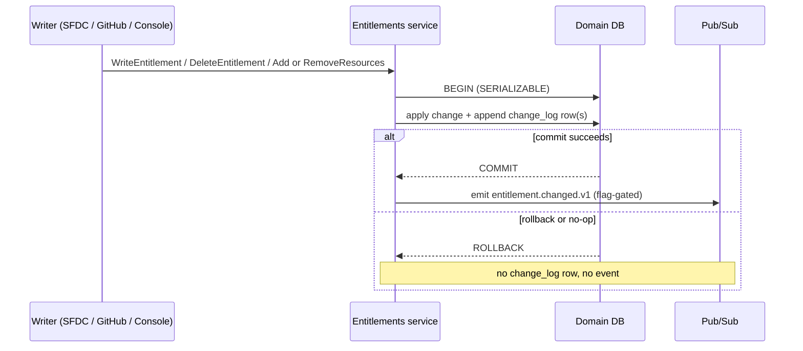
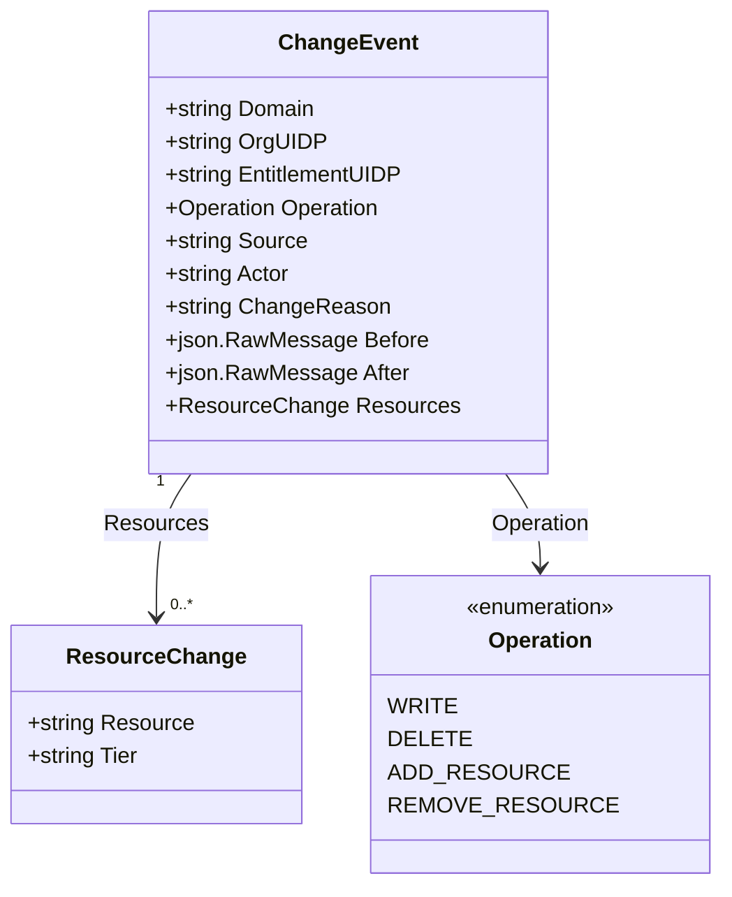
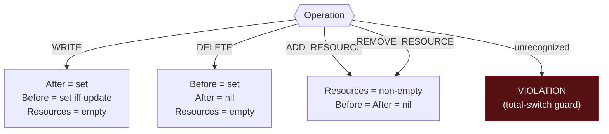

# `dev.chainguard.entitlement.changed.v1` — event contract

The single, authoritative contract for the CloudEvent emitted by the Centralized
Entitlements Service when an entitlement (or one of its bound resources) changes.
Producers (the write RPCs, CUS-684) and subscribers both program against **this
document**; the Go types in `entitlements.go` are the encoding of it.

---

## 1. Purpose & emit lifecycle

One event type serves every entitlement domain. The change timestamp lives on the
CloudEvent **envelope** (`time`), never in the body. The event is emitted **only on
transaction commit** and is flag-gated until the notification service exists to
consume it (CUS-684).

This event is an **audit / fan-out primitive**, not a rendered notification payload.
The notification service enriches it (resource URL, value description, etc., per its
own required schema) — those fields are deliberately out of scope here.

### Envelope extension attributes (filtering)

Subscribers filter *without decoding the body* via CloudEvent **extension
attributes** (the framework's `Extendable` / `CloudEventsExtension` convention).
`ChangeEvent` exposes:

| extension key | value | filter use |
|---|---|---|
| `GroupKey` (existing) | `OrgUIDP` | org-scoped subscriptions |
| `EntitlementDomainKey` (new) | `Domain` | subscribe to one domain (e.g. `IMAGE`) |
| `EntitlementOperationKey` (new) | `Operation` | subscribe to one change kind (e.g. `DELETE`) |

Any other key returns `("", false)`. These are envelope context attributes, not
body fields — the body still carries the full record (§2).

---

## 2. Structure

**`ResourceChange`** (json key order = struct order):

| field | json | required | meaning |
|---|---|---|---|
| `Resource` | `resource` | yes | the resource's own name (e.g. the repo name for IMAGE) |
| `Tier` | `tier` | optional (`omitempty`) | catalog tier, when applicable to the domain |

There is **no resource UIDP** by design: a source-row UIDP would be the source repo's
`chainguard-private` UIDP — meaningless to the customer and a privacy leak — and no
customer-meaningful id exists at emit time (the customer-org resource is created later
at reconcile). The proto carries the resource **name**, not an id. A resource is
identified by `Resource` + `Tier` **within** its entitlement (§3).

---

## 3. Identity — "which entitlement changed"

The subject is identified by the top-level **`EntitlementUIDP`**. Nothing else in the
event is a reliable entitlement identifier:

| field | json | required | meaning |
|---|---|---|---|
| `Domain` | `domain` | yes | canonical domain token (§6) |
| `OrgUIDP` | `org_uidp` | yes | owning organization |
| `EntitlementUIDP` | `entitlement_uidp` | yes (**every** Operation) | the changed entitlement's UIDP |
| `Operation` | `operation` | yes | the change kind (§5) |

**Relation to the durable change_log** (which this event mirrors): for
entitlement-grain ops (`WRITE`/`DELETE`) `EntitlementUIDP` equals the change_log's
`SubjectUIDP`. For resource-grain ops (`ADD_RESOURCE`/`REMOVE_RESOURCE`) the
change_log subject is the *resource* row; there `EntitlementUIDP` is the owning
entitlement (the resource's parent), not the change_log `SubjectUIDP`. Either way it
is the entitlement.

---

## 4. Attribution — "who made the change"

Distinct from the emit-time caller on the `events.Occurrence` envelope: for
machine-driven syncs the envelope carries the service-account credential, while these
fields carry the originator the change is *attributed* to.

| field | json | meaning |
|---|---|---|
| `Source` | `source` | system of record; the `EntitlementSource` enum's **leaf name with the `ENTITLEMENT_SOURCE_` prefix stripped** (e.g. `SALESFORCE`), by reference (§6) |
| `Actor` | `actor` | identity the change is attributed to (e.g. SFDC opportunity, GitHub actor) |
| `ChangeReason` | `change_reason` | free-text reason recorded with the change |

---

## 5. Operation grain rules

`Domain`, `OrgUIDP`, `EntitlementUIDP`, `Operation` are **always set**. Beyond that,
each Operation populates exactly its own fields — the `grainViolation` predicate is
the machine-checked form of this table, tested in both directions (well-formed
accepted, every illegal combination rejected).

| Operation | Before | After | Resources | grain |
|---|---|---|---|---|
| `WRITE` | set iff update (nil ⇒ create) | **set** | empty | entitlement |
| `DELETE` | **set** | nil | empty | entitlement |
| `ADD_RESOURCE` | nil | nil | **non-empty** | resource |
| `REMOVE_RESOURCE` | nil | nil | **non-empty** | resource |

Consumers must treat an unrecognized **`Operation`** *or* an unrecognized **`Domain`**
as a signal to re-fetch authoritative state (or log-and-skip) — never to silently
discard the change. Both vocabularies grow in minor versions (§6), so an older
subscriber seeing a value it doesn't know is an expected, live case.

---

## 6. Vocabulary

| token class | home | why |
|---|---|---|
| `Operation` | SDK consts, pinned by test | the event's own closed set |
| `Domain` | SDK consts `DomainImage/Library/Package/HelmChart/Feature`, pinned by golden vector | the event's own field; `public/sdk` can't import the enum, so these are the public mirror of `EntitlementDomain` — the enum's leaf name, `ENTITLEMENT_DOMAIN_` prefix stripped |
| `Source`, `Tier` | **by reference** to `EntitlementSource` / `CatalogTier` — NOT duplicated in the SDK | those enums grow; a hand-copied SDK duplicate would drift. Tokens are the enum leaf name (`Source` strips the `ENTITLEMENT_SOURCE_` prefix; `CatalogTier` leaves carry no prefix — the leaf *is* the token, e.g. `APPLICATION`) |

**Cross-check ownership & interim exposure:** the `SDK Domain const == stripped enum
leaf` agreement can only be asserted where both are importable — the emitter (CUS-684).
Until then the SDK Domain consts have no *automated* agreement check against the enum;
the golden-vector test pins their literal spelling, and the enum leaf names are named
in-comment so drift is at least human-visible before CUS-684.

---

## 7. Delivery & ordering

Pub/Sub delivery is **at-least-once and unordered**. Therefore:

- Consumers **must be idempotent** — the same event may arrive more than once.
- Consumers **must not** apply `WRITE` as a positional delta off `Before`; on any
  `WRITE` (or on doubt) **re-fetch** authoritative state via `GetEffectiveEntitlements`.
- No cross-event ordering is guaranteed; do not assume a `DELETE` follows its `WRITE`.

The event carries no dedup key today; if a consumer needs strict dedup, that is a
follow-on (a stable change_log row identifier could be surfaced — see §10).

---

## 8. Audience & redaction

`Before`/`After` carry entitlement snapshots (which can include quota / commercial
figures) and `Actor`/`ChangeReason` are free-text (can carry opportunity ids / PII).
This event is **internal / audit audience**; it is not delivered to a customer-facing
sink as-is. Before any customer-audience fan-out, the emitter (CUS-684) must redact
`Before`/`After`/`Actor` via the SDK `CloudEventsRedact()` seam. No customer sink
consumes this type until that redaction path exists.

---

## 9. Wire shape & compatibility

- Exact JSON keys are pinned by golden literals (a `WRITE` fixture and an
  `ADD_RESOURCE` fixture — one legal grain each, so no fixture is an illegal state).
  Key order = struct declaration order.
- **Additive-only** evolution: new fields land `omitempty` where optional. Existing
  key spellings never change (a rename is a new event version, `...changed.v2`).
  Round-trip tests can't catch a tag rename; the golden literals can.

---

## 10. Settled at emitter time (CUS-684), not in this PR

These need the producer that does not exist yet; the event *shape* here is designed to
accommodate them:

- **Emit cardinality:** whether a resource op sends one event per resource (matching
  the one-change_log-row-per-resource TODO in the write path) or one batched event.
  `Resources` is an array to support either; the emitter decides and the batch/per-row
  decision is documented there. (Consumers must handle both regardless, per §7.)
- **Vocabulary cross-check:** the `SDK Domain const == stripped enum leaf` assertion
  (§6), where both are importable.
- **Dedup key:** whether to surface a stable change_log row identifier for §7 dedup.
