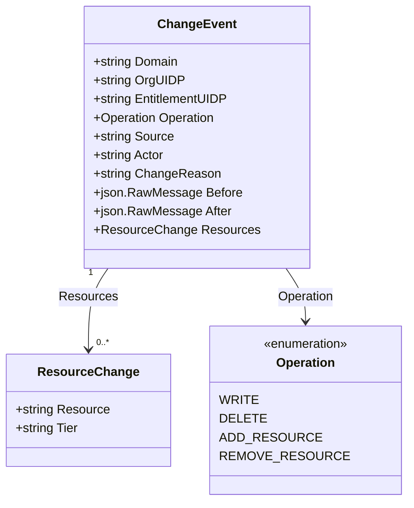
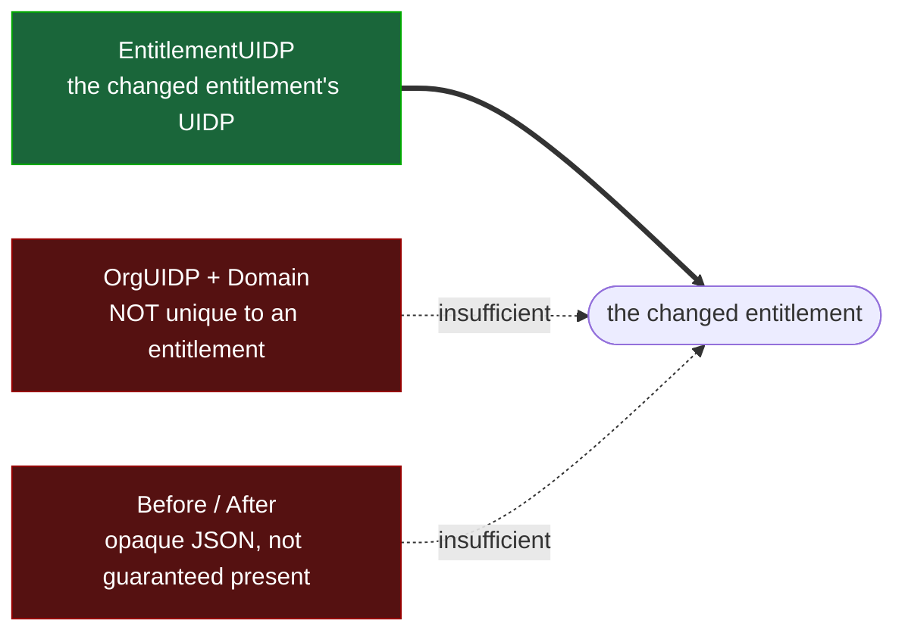
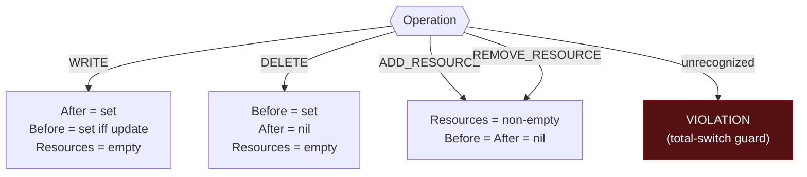

# `dev.chainguard.entitlement.changed.v1` — event contract

The authoritative contract for the CloudEvent emitted when an entitlement (or one
of its bound resources) changes. Subscribers program against **this document**;
the Go types in `entitlements.go` are its encoding.

---

## 1. Purpose & emit lifecycle

One event type serves every entitlement domain. The change timestamp lives on the
CloudEvent **envelope** (`time`), never in the body. The event is emitted **only on
a committed change**, to a **customer** audience — it is the raw mutation stream a
consumer can subscribe to for its own entitlements. It carries the change itself,
not a rendered notification payload.

A change that rolls back, and a write that resolves to a no-op, emit nothing.

### Envelope extension attributes (filtering)

Subscribers filter *without decoding the body* via CloudEvent **extension
attributes** (the `Extendable` / `CloudEventsExtension` convention). `ChangeEvent`
exposes:

| extension key | value | filter use |
|---|---|---|
| `GroupKey` | `OrgUIDP` | org-scoped subscriptions |
| `EntitlementDomainKey` | `Domain` | subscribe to one domain (e.g. `IMAGE`) |
| `EntitlementOperationKey` | `Operation` | subscribe to one change kind (e.g. `DELETE`) |

Any other key returns `("", false)`. These are envelope context attributes, not
body fields — the body still carries the full record (§2).

---

## 2. Structure

**`ResourceChange`** (json key order = struct order):

| field | json | required | meaning |
|---|---|---|---|
| `Resource` | `resource` | yes | the resource's own name (e.g. the repo name for IMAGE) |
| `Tier` | `tier` | optional (`omitempty`) | catalog tier, when applicable to the domain |

There is **no resource UIDP**: no stable, customer-meaningful id exists for a
resource at emit time, so the resource **name** identifies it within its
entitlement. `Resources` may carry one or many entries for a resource-grain change,
so consumers must handle both.

---

## 3. Identity — "which entitlement changed"

The subject is identified by the top-level **`EntitlementUIDP`**. Nothing else in the
event is a reliable entitlement identifier:

| field | json | required | meaning |
|---|---|---|---|
| `Domain` | `domain` | yes | canonical domain token (§6) |
| `OrgUIDP` | `org_uidp` | yes | owning organization |
| `EntitlementUIDP` | `entitlement_uidp` | yes (**every** Operation) | the changed entitlement's UIDP |
| `Operation` | `operation` | yes | the change kind (§5) |

For resource-grain operations (`ADD_RESOURCE` / `REMOVE_RESOURCE`),
`EntitlementUIDP` is the owning entitlement the resources belong to.

---

## 4. Attribution — "who made the change"

Distinct from the emit-time caller on the `events.Occurrence` envelope: these fields
describe the surface and originator this change is *attributed* to. `Source` here is
the **change surface** — the surface that made this change — **not** the
entitlement's system of record (its managing/owning source), which is carried on the
`Before`/`After` snapshot's own `source` field. These are two distinct uses of
`EntitlementSource`; the shared name is a known overload, tracked for a rename in
CUS-1263.

| field | json | meaning |
|---|---|---|
| `Source` | `source` | the surface that made this change (e.g. `CONSOLE_ADMIN` for an admin edit of an SFDC-managed grant), so a subscriber can spot an unexpected editor. `EntitlementSource` leaf name, `ENTITLEMENT_SOURCE_` prefix stripped (§6). Required on every write, so it is never `UNSPECIFIED`. |
| `Actor` | `actor` | identity the change is attributed to. **Redacted on the wire** (§8) |
| `ChangeReason` | `change_reason` | free-text reason recorded with the change. **Redacted on the wire** (§8) |

`Actor` and `ChangeReason` are blanked on the emitted event; `Source` (the change
surface) is emitted. The entitlement's own system-of-record source is on the
snapshot, not here. See §8.

---

## 5. Operation grain rules

`Domain`, `OrgUIDP`, `EntitlementUIDP`, `Operation` are **always set**. Beyond that,
each Operation populates exactly its own fields:

| Operation | Before | After | Resources | grain |
|---|---|---|---|---|
| `WRITE` | set iff update (nil ⇒ create) | **set** | empty | entitlement |
| `DELETE` | **set** | nil | empty | entitlement |
| `ADD_RESOURCE` | nil | nil | **non-empty** | resource |
| `REMOVE_RESOURCE` | nil | nil | **non-empty** | resource |

Consumers must treat an unrecognized **`Operation`** *or* an unrecognized **`Domain`**
as a signal to re-fetch authoritative state (or log-and-skip) — never to silently
discard the change. Both vocabularies may grow in minor versions (§6), so an older
subscriber seeing a value it doesn't know is an expected, live case.

---

## 6. Vocabulary

| token class | source | note |
|---|---|---|
| `Operation` | SDK constants | the event's own closed set |
| `Domain` | SDK constants (`DomainImage` / `DomainLibrary` / `DomainPackage` / `DomainHelmChart` / `DomainFeature`) | the public token for each entitlement domain — the domain enum's leaf name, `ENTITLEMENT_DOMAIN_` prefix stripped |
| `Source`, `Tier` | the `EntitlementSource` / `CatalogTier` enum leaf names, **by reference** | not duplicated as SDK constants, since those enums grow. `Source` strips the `ENTITLEMENT_SOURCE_` prefix; `CatalogTier` leaves carry no prefix (e.g. `APPLICATION`) |

---

## 7. Delivery & ordering

Delivery is **best-effort and unordered** today. The event is published on a
detached, bounded-retry send after the write commits; a process exit before the
send, or a sink that stays unavailable past the retries, drops that event with no
replay. The durable record of every change is the per-domain `entitlement_change_log`
in MySQL, written in the same transaction as the change — the event stream is a
derivative of it, not the source of truth. Restoring an at-least-once guarantee via a
transactional outbox (publish from the log) is tracked in CUS-1264.

Therefore:

- Consumers **must not** treat this stream as complete: an event may be missing.
  For anything that must not miss a change, reconcile against
  `GetEffectiveEntitlements` (or the change log) rather than relying on delivery.
- Consumers **must be idempotent** — an event may also arrive more than once.
- Consumers **must not** apply `WRITE` as a positional delta off `Before`; on any
  `WRITE` (or on doubt) **re-fetch** authoritative state via `GetEffectiveEntitlements`.
- No cross-event ordering is guaranteed; do not assume a `DELETE` follows its `WRITE`.

The event carries no dedup key of its own; a consumer that needs strict dedup can
use the CloudEvent envelope `id`.

---

## 8. Audience & redaction

Emitted to a **customer** audience: the entitlement is the consumer's own product.
`Actor` and `ChangeReason` are **redacted (blanked)** on the wire, because they can
carry internal identities and free-text notes for changes made on the consumer's
behalf. The `Before` / `After` snapshots are emitted (the consumer's own entitlement
state) but with two internal fields stripped: nested `change_attribution`, and
`external_id` — the writer's key, which for SFDC-managed grants is a Salesforce
opportunity ID; `EntitlementUIDP` already identifies the entitlement. The top-level
`Source` (the change surface, §4) is emitted.

---

## 9. Wire shape & compatibility

- Exact JSON keys are stable; key order follows struct declaration order.
- **Additive-only** evolution: new fields are added `omitempty` where optional.
  Existing key spellings never change — a rename ships as a new event version
  (`...changed.v2`).
